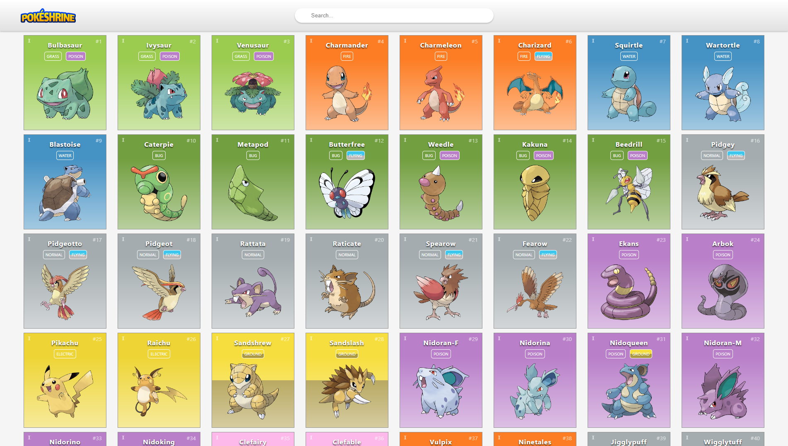

# PokéShrine Pokemon Index

## What Does It Do?

The PokéShrine Pokémon index was a small project I started to test styling elements and also to allow people to search for various pokémon from different generations.

The application is able to overlay the top of the fullscreen Elden Ring window and allows for seemless integration when searching for items.

## How Does It Work?

With use of the [PokéAPI](https://pokeapi.co/) Pokémon API, a database has been created listing every pokémon within each of the games, this inlcudes the generation they belong to and what pokémon type they are.

